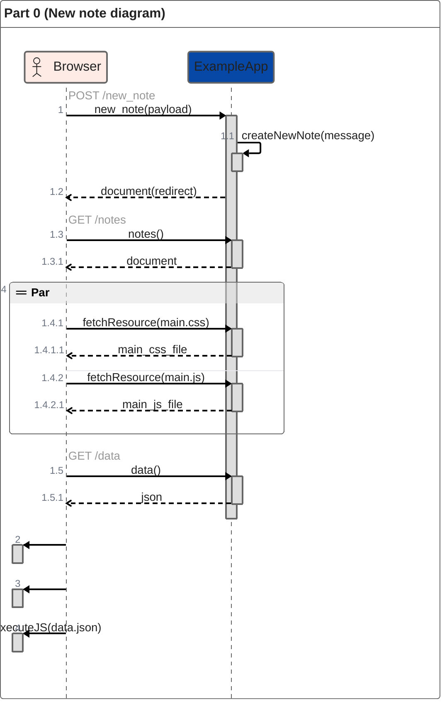

```mermaid
zenuml
    title Part 0 (New note diagram)
    @Actor Browser #FFEBE6
    ExampleApp #0747A6

    @Starter(Browser)
    // `POST /new_note`
    ExampleApp.new_note(payload) {
        note = ExampleApp.createNewNote(message)
        return document(redirect)

        // `GET /notes`
        Browser->ExampleApp.notes() {
            return document
        }
        par {
            main_css_file = Browser->ExampleApp.fetchResource(main.css)
            main_js_file = Browser->ExampleApp.fetchResource(main.js)
        }
        // `GET /data`
        Browser->ExampleApp.data() {
            return json
        }
      }
      Browser.executeJS(data.json)
    }
```