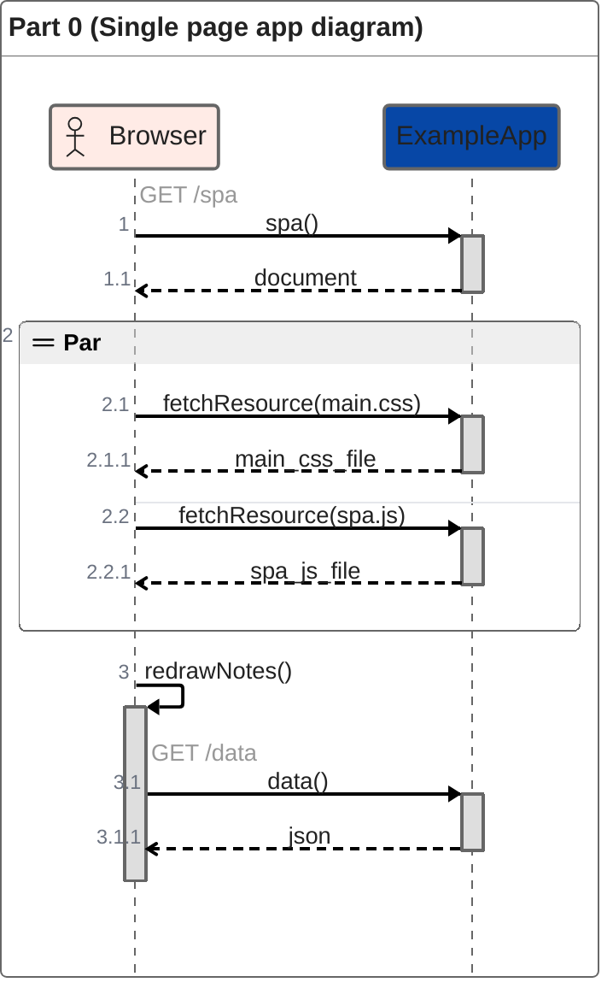

```mermaid
zenuml
    title Part 0 (Single page app diagram)
    @Actor Browser #FFEBE6
    ExampleApp #0747A6

    @Starter(Browser)
    // `GET /spa`
    document = ExampleApp.spa()

    par {
        main_css_file = Browser->ExampleApp.fetchResource(main.css)
        spa_js_file = Browser->ExampleApp.fetchResource(spa.js)
    }
    
    Browser.redrawNotes() {
        // `GET /data`
        Browser->ExampleApp.data() {
            return json
        }
        
    } 
```