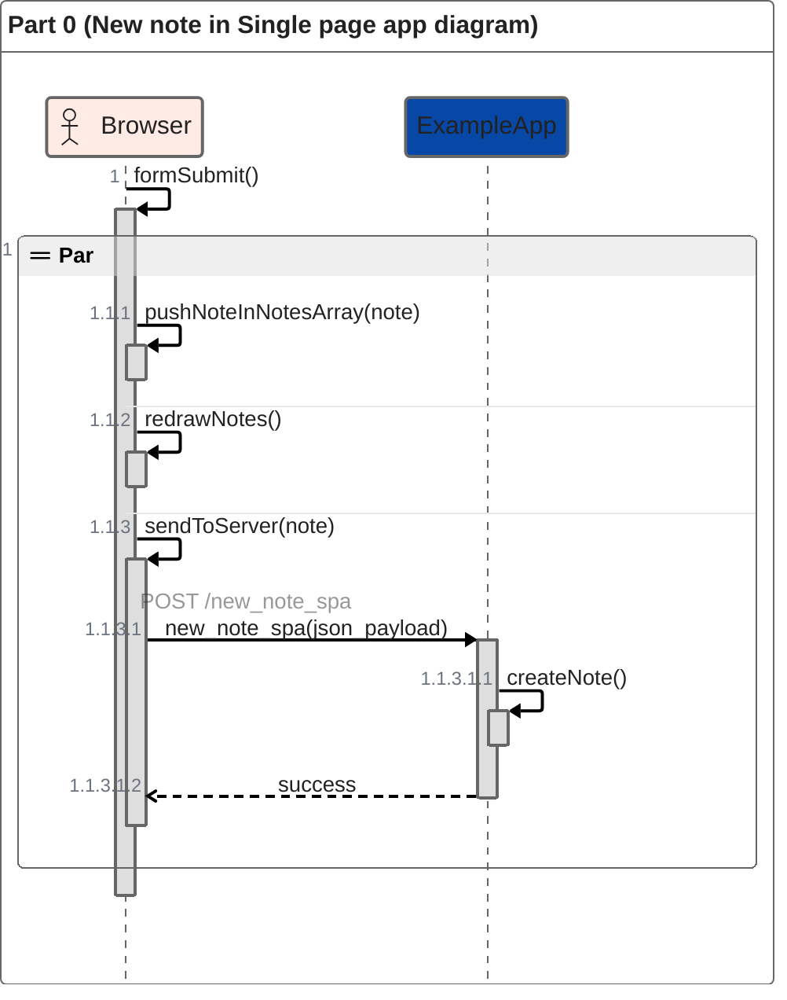

```mermaid
zenuml
    title Part 0 (New note in Single page app diagram)
    @Actor Browser #FFEBE6
    ExampleApp #0747A6

    @Starter(Browser)
    Browser.formSubmit() {
        par {
            Browser.pushNoteInNotesArray(note)
            Browser.redrawNotes()
            Browser.sendToServer(note) {
                // `POST /new_note_spa`
                ExampleApp.new_note_spa(json_payload) {
                    success = ExampleApp.createNote()
                    return success
                }
            }
        }
    }
    
```